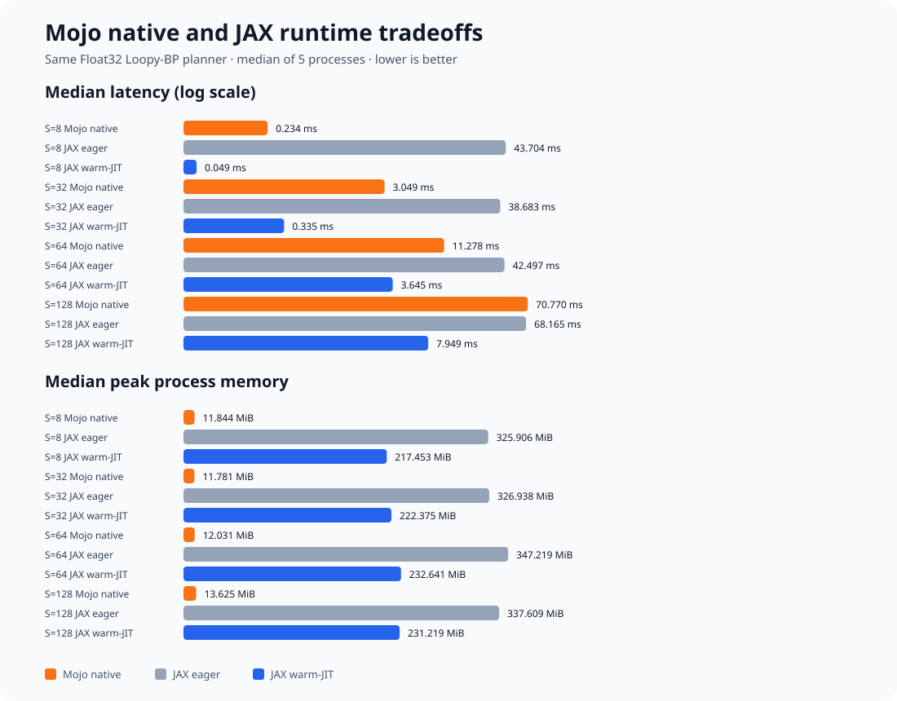

# AIF.mojo 🔥

[](https://github.com/antonvice/AIF.mojo/actions/workflows/ci.yml)
[](LICENSE)
[](https://mojolang.org/)

A standalone, CPU-first toolkit for **active inference and message-passing
planning, written in Mojo**. It provides native belief updates, finite-horizon
planners, environment models, and agent steps for partially observable worlds.

Use it when you want explicit, inspectable Active Inference kernels without a
Python or JAX runtime in the numerical core. The project currently targets
correctness, deterministic behavior, and low-memory CPU execution.

## What it includes

- Eight planners: Loopy BP, Loopy VBP, Region-Extended Loopy BP,
  Dynamic-Channel Loopy BP, Nuijten MP, VBP Channel, Precise Information
  Seeking, and Active Inference.
- Dense execution for all eight, plus deterministic sparse/precomputed paths
  where the model permits them.
- Terminal-state, theta-dependent, observation-space, and time-indexed state
  preference APIs.
- Native models for Frozen Lake, Wumpus World, RockSample, and MiniGrid
  DoorKey.
- Belief updates, planner dispatch, convergence/VFE traces, pure Frozen Lake,
  Wumpus, and RockSample simulator steps, runnable examples, and a precompiled
  `.mojoc` package.
- Flat, row-major `List[Float32]` and `List[Int]` tensors with documented axes.
  There is no hidden NumPy dependency or general tensor framework.

## Quick start

Install [Pixi](https://pixi.sh/), then:

```bash
pixi install
pixi run bootstrap-oracle
pixi run sync-oracle
pixi run manifest
pixi run example-frozen
```

The last command runs a visible native episode. The agent observes a noisy 2x2
Frozen Lake, updates its belief over two possible hole layouts, plans with
Loopy BP, and renders every action:

```text
STEP 0                         STEP 1                         FINAL
+-----+-----+                 +-----+-----+                 +-----+-----+
|  A  |  H  |                 |  .  |  H  |                 |  .  |  H  |
+-----+-----+                 +-----+-----+                 +-----+-----+
|  .  |  G  |  -- DOWN -->    |  A  |  G  |  -- RIGHT -->   |  .  | A/G |
+-----+-----+                 +-----+-----+                 +-----+-----+

posterior theta: [0.98, 0.02]  posterior theta: [0.99973, 0.00027]
SUCCESS — goal reached in 2 steps
```

## Use the planners

The smallest examples are:

```bash
pixi run example-loopy   # deterministic-sparse Loopy BP
pixi run example-all     # all eight planners on one explicit model
pixi run example-frozen  # complete belief-plan-step episode
```

Mojo callers import from `aif_mojo` and pass flat buffers plus dimensions. For
example, the public dense Loopy-BP entry point returns the normalized first
action distribution:

```mojo
from aif_mojo.loopy_bp import loopy_bp_planning_dense

var q_u = loopy_bp_planning_dense(
    q_state,
    q_theta,
    transition,  # T(new_state, old_state, theta, action)
    goal,        # C(state)
    action_prior,
    horizon,
    iterations,
    n_states,
    n_actions,
    n_theta,
)
```

See [`examples/`](examples/) for complete inputs and
[`TECHNICAL_DESIGN.md`](TECHNICAL_DESIGN.md) for every tensor contract
and planner path.

## Mojo versus JAX



This is a fair CPU comparison of the **same** dense Float32 Loopy-BP fixture.
AOT/JIT compilation and three warm-up calls are separated from repeated
in-process calls. Five independent processes are measured for every backend at
four state-space sizes, and every process must return the same normalized policy
within `1e-5`. Both backends use their default CPU worker pools. The historical
beta build used parallel dense reductions; the current standalone Mojo 1.0.0
build uses the deterministic serial fallback because the parallel runtime moved
behind MAX.

<!-- BENCHMARK_RESULTS_START -->
Median and bootstrap 95% CI across five independent processes. Lower latency and memory are better.

| States | Backend | Compile (s) | Latency, ms (95% CI) | Calls/s (95% CI) | Peak RSS | Planner RSS delta |
|---:|---|---:|---:|---:|---:|---:|
| 8 | Mojo native | 4.796 | 0.070 [0.058, 0.071] | 14317.388 [14058.650, 17282.871] | 12.3 MiB | 0.9 MiB |
| 8 | JAX eager | 0.000 | 82.350 [67.221, 97.144] | 12.143 [10.294, 14.876] | 343.1 MiB | 231.8 MiB |
| 8 | JAX warm-JIT | 0.410 | 0.110 [0.100, 0.125] | 9131.472 [8025.559, 10014.269] | 214.8 MiB | 103.8 MiB |
| 32 | Mojo native | 4.796 | 1.507 [1.127, 1.985] | 663.423 [503.818, 887.020] | 12.4 MiB | 1.0 MiB |
| 32 | JAX eager | 0.000 | 95.672 [72.186, 112.277] | 10.452 [8.907, 13.853] | 343.6 MiB | 232.7 MiB |
| 32 | JAX warm-JIT | 0.606 | 0.656 [0.582, 1.115] | 1525.196 [896.536, 1717.124] | 226.6 MiB | 115.7 MiB |
| 64 | Mojo native | 4.796 | 3.241 [3.196, 3.402] | 308.573 [293.982, 312.850] | 12.6 MiB | 1.2 MiB |
| 64 | JAX eager | 0.000 | 76.872 [67.855, 85.713] | 13.009 [11.667, 14.737] | 348.1 MiB | 237.1 MiB |
| 64 | JAX warm-JIT | 0.463 | 3.759 [3.554, 4.393] | 266.011 [227.657, 281.334] | 227.2 MiB | 116.2 MiB |
| 128 | Mojo native | 4.796 | 10.552 [9.876, 11.249] | 94.765 [88.900, 101.257] | 13.9 MiB | 2.5 MiB |
| 128 | JAX eager | 0.000 | 103.585 [68.354, 113.865] | 9.654 [8.782, 14.630] | 360.4 MiB | 249.5 MiB |
| 128 | JAX warm-JIT | 0.521 | 8.540 [7.693, 9.768] | 117.100 [102.377, 129.990] | 231.1 MiB | 120.2 MiB |

Historical snapshot: Apple M4 (arm64), Mojo 1.0.0b2 (2cf4d08a), 2026-08-19. [Full process-level JSON](docs/benchmarks/2026-08-19.json).
These are machine-specific measurements, not universal language claims.
<!-- BENCHMARK_RESULTS_END -->

Relative to the [v0.1.0 benchmark](https://github.com/antonvice/AIF.mojo/blob/v0.1.0/docs/benchmarks/2026-08-19.json)
on the same Apple M4, the optimized Mojo median is 3.3×, 2.0×, 3.5×, and 6.7×
faster at 8, 32, 64, and 128 states.
In this snapshot Mojo has the lower warm-call median at 8 and 64 states; JAX
warm-JIT leads at 32 and 128 states.

Choose **Mojo native** when low process memory, predictable native deployment,
or avoiding a Python/XLA runtime matters. Choose **JAX warm-JIT** when peak CPU
throughput on repeated array programs matters and its runtime/compile footprint
is acceptable. JAX eager is valuable for research iteration and debugging, but
is not the fast deployment path in this fixture.

For repeated dense terminal-goal planning, construct `PreparedDenseLoopyBP`
once and call `plan()` at every agent step. It caches the static transition,
goal, and action-prior logs and reuses one scratch workspace:

```mojo
from aif_mojo.loopy_bp import PreparedDenseLoopyBP

var planner = PreparedDenseLoopyBP(
    transition, goal, action_prior, horizon, iterations,
    n_states, n_actions, n_theta,
)
var policy = planner.plan(q_state, q_theta)
```

Loopy BP's prepared planner owns mutable scratch storage; use one instance per
concurrently executing agent. `PreparedDenseVBP[H, I]`,
`PreparedDenseRMMP[H, I]`, and `PreparedDenseAIFMP[H, I]` cache their static
log-domain inputs and specialize the horizon and iteration budget at compile
time.

### Convergence research controls

BP, VBP, RM-MP, and AIF-MP expose residual-aware planning entry points. The
channel methods can stop when the maximum absolute channel update is below a
tolerance and can optionally adapt damping when residuals worsen or improve.
The Appendix F.5 runner freezes the paper configurations, uses the documented
`1e-4` criterion, six damping values, five seeds, and 1,000-iteration budget:

```bash
pixi run appendix-f5-smoke     # exact Frozen config, two-iteration plumbing gate
pixi run appendix-f5           # full fixed-damping paper-scale sweep
pixi run appendix-f5-adaptive  # research extension; not a paper baseline
```

The full sweeps are intentionally not CI gates. They write JSON and CSV under
`data/appendix_f5/` and can take substantial CPU time and memory. The paper-v4
RockSample prose and the authors' current public executable disagree on the
state/action model (16/9 in the paper versus 640/8 in code), so full episode
reproduction is not labeled exact until that upstream ambiguity is resolved.

The native episode runner crosses the paper's five reported methods with its
three environments and uses the paper horizons, iteration budgets, and selected
damping values:

```bash
pixi run paper-experiments-smoke  # all five methods plus all three environments
pixi run paper-experiments        # 5 methods x 3 environments x 1,000 episodes
```

The full result labels itself `authors-public-code-at-30ee6f0`: Frozen Lake and
Wumpus follow the public experiment configuration, while RockSample retains the
authors' executable 640-state/8-action model rather than pretending it is the
paper prose's 16-state/9-action model. Episode seeds are deterministic in Mojo,
but are not NumPy bitstream-identical. JSON and CSV are written under
`data/paper_experiments/`; the full run is intentionally not a CI gate.

Reproduce the comparison on your machine:

```bash
pixi run benchmark
# JSON: benchmarks/results/fair_latest.json

pixi run benchmark-publication  # five processes, dated JSON, README + SVG
```

`pixi run benchmark-process` is a separate launch-time regression benchmark;
its samples include process startup and must not be mixed with the in-process
table above. Methodology and optimization notes are in
[`MOJO_UPGRADE_NOTES.md`](MOJO_UPGRADE_NOTES.md).

### Motor-imagery EEG experiment

This optional Python research harness compares a linear baseline, an LIF
spiking reservoir, and a sequential Active Inference decoder using
leakage-safe subject-wise folds. It exercises AIF decision semantics around the
native library; it is not a Mojo EEG implementation or evidence that AIF
improves BCI accuracy.

```bash
pixi run test-eeg
pixi run eeg-smoke
```

The default data are synthetic and validate only the benchmark pipeline. Pilot
and held-out tuning artifacts are checked in for auditability. See
[`benchmarks/eeg_motor_imagery/README.md`](benchmarks/eeg_motor_imagery/README.md)
for the real EEG NPZ schema, the optional trainable Spiking-EEGNet experiment,
and interpretation limits. On the fresh held-out subjects 21-30, its published
three-seed result reached 0.6052 balanced accuracy versus 0.5319 for logistic
regression and 0.5452 for the tuned LIF reservoir. Treat this as one
subject-separated cohort result, not a general BCI claim; the full record is
[`benchmarks/results/spiking_eegnet.json`](benchmarks/results/spiking_eegnet.json).

## Verify it

```bash
pixi run test                # native Mojo suites
pixi run parity              # planner/message differentials
pixi run parity-env          # environment and agent differentials
pixi run parity-convergence  # VFE and full convergence traces
pixi run check               # native release gate
pixi run check-all           # also run the frozen JAX suite
```

The nested JAX checkout is a read-only test oracle, not a native-library runtime
dependency.
The manifest pins its commit, Python/JAX versions, tensor axes, tolerances, and
deterministic tapes. Python is retained for oracle comparison, JSON
orchestration, and explicitly separated research harnesses such as the EEG
experiment; the planners and environment models remain native Mojo.

## Project boundaries

The numerical core is native Mojo and CPU-first. General NDArray semantics,
autodiff, GPU kernels, native plotting/video, and cross-runtime random-stream
identity remain out of scope. Mojo 1.0.0 moved `LayoutTensor`, accelerator host
APIs, and the parallel runtime behind MAX; the measured adoption criteria are
recorded in the [layout/batch/GPU evaluation](docs/ACCELERATOR_EVALUATION.md).
See the [technical design](TECHNICAL_DESIGN.md) for details.

## Acknowledgements

This standalone Mojo implementation was validated against
[`biaslab/UAI-MP-AIF-JAX`](https://github.com/biaslab/UAI-MP-AIF-JAX), companion
code for [*What Type of Inference Is Active Inference?*](https://arxiv.org/abs/2606.04935)
by Wouter W. L. Nuijten, Mykola Lukashchuk, Thijs van de Laar, and Bert de
Vries. Thank you to its Git
contributors [Wouter Nuijten](https://github.com/biaslab/UAI-MP-AIF-JAX/commits?author=wouternuijten)
and [Mykola Lukashchuk](https://github.com/biaslab/UAI-MP-AIF-JAX/commits?author=nikola-lukashuk)
for the original research implementation and canonical environment semantics.
The reference repository remains unmodified at commit
`30ee6f0ebce32c6a430fa7c25f1c01390415a797`.

## Contributing, citation, and license

See [CONTRIBUTING.md](CONTRIBUTING.md) for the correctness and validation
contract, [CITATION.cff](CITATION.cff) for software and paper citations, and
[API stability](docs/API_STABILITY.md) for compatibility guarantees.

AIF.mojo is licensed under [Apache-2.0](LICENSE). The separately fetched JAX
oracle is not distributed under this license; see [NOTICE](NOTICE).
